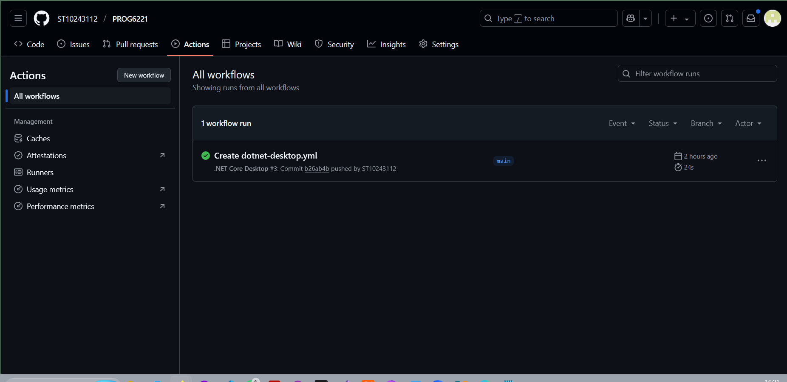

# PROG6221# PROG6221 – Cybersecurity Awareness Chatbot

This repository contains a C# console-based chatbot application designed to promote cybersecurity awareness. The chatbot features interactive keyword-based conversations, system voice greetings, colored output for better readability, and input validation.

**GitHub Repo Link:**  
[https://github.com/ST10243112/PROG6221.git](https://github.com/ST10243112/PROG6221.git)

---

## Continuous Workflow Screenshot

Below is a screenshot of the GitHub Actions workflow.

---

##  References

- Ciampa, M., 2021. *CompTIA Security+ Guide to Network Security Fundamentals*. 7th ed. Boston: Cengage Learning.  
- Microsoft, 2025. [Dictionary<TKey,TValue> Class (System.Collections.Generic)](https://learn.microsoft.com/en-us/dotnet/api/system.collections.generic.dictionary-2?view=net-9.0) [Accessed 15 April 2025].  
- Microsoft, 2025. [Console.ResetColor Method (System)](https://learn.microsoft.com/en-us/dotnet/api/system.console.resetcolor?view=net-9.0) [Accessed 15 April 2025].  
- Microsoft, 2024. [Password Policy Recommendations](https://learn.microsoft.com/en-us/microsoft-365/admin/misc/password-policy-recommendations?view=o365-worldwide) [Accessed 15 April 2025].  
- Patorjk.com, [n.d.] [TAAG – Text to ASCII Art Generator](https://patorjk.com/software/taag/#p=display&f=Graffiti&t=Cybersecurity%20Awareness%20%20) [Accessed 15 April 2025].  
- Postman, 2025. [How to Get an OpenAI API Key – YouTube](https://www.youtube.com/watch?v=dJ5aIRUyhNA&t=26s) [Accessed 15 April 2025].

---

**Student No:** ST10243112  
**Institution:** IIE MSA  
**Module:** PROG6221 – Programming